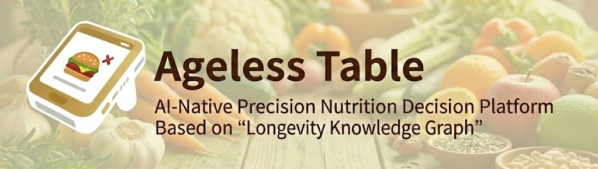
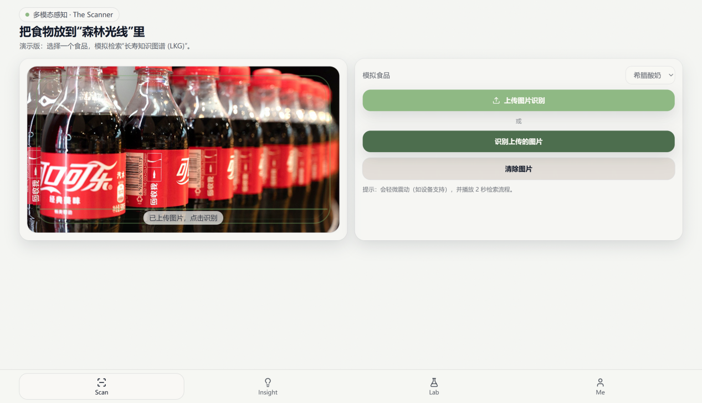
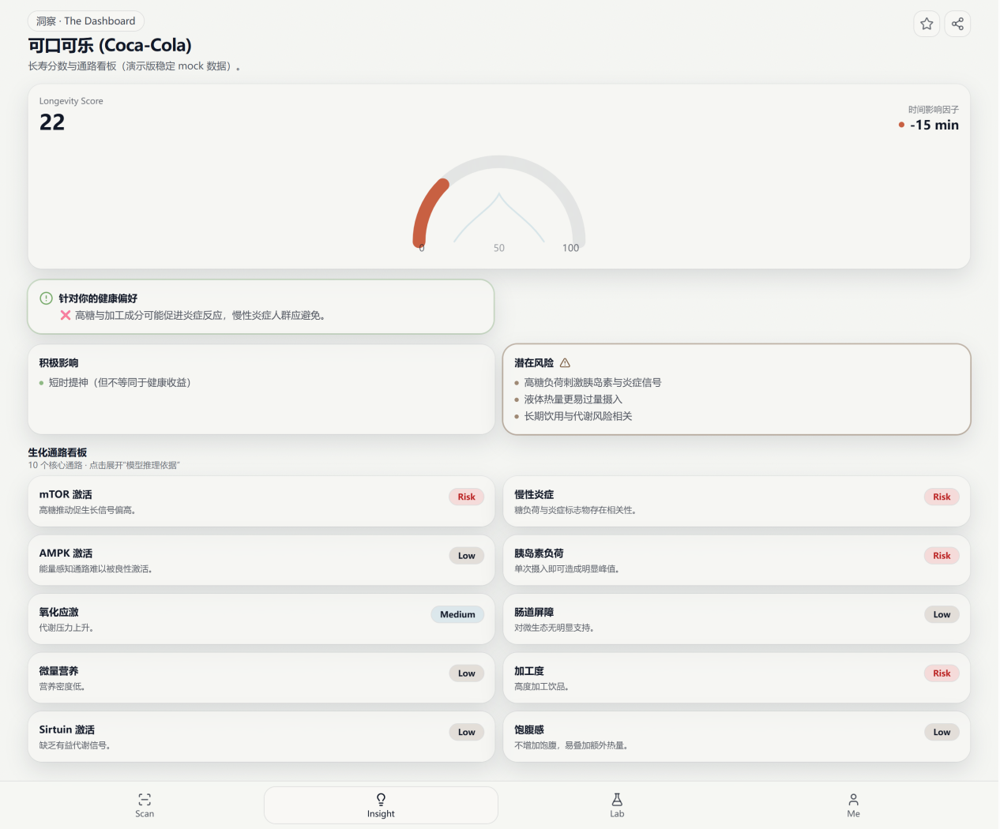

# 逆龄餐桌 (Ageless Table)

> **基于知识图谱与多智能体协同的抗衰老营养分析引擎。**  
> **扫一扫，为健康加时（Scan a Day, Keep Aging at Bay）**

[English README →](./README.md)

---

## Banner



---

## 项目简介（Abstract）

**逆龄餐桌**是一款基于“长寿知识图谱”的 AI 原生精准营养决策平台原型。  
它帮助用户从“疾病治疗”的被动模式，转向“日常预防”的主动模式：将食物的成分与营养架构映射到长寿生物学通路（如 mTOR / AMPK / Sirtuin / 慢性炎症），并以可解释的方式量化呈现，支持每一次更聪明的选择。

---

## 核心特性（Key Features）

### 🧠 Knowledge-Grounded Reasoning（拒绝幻觉）

把结论钉在“证据”上：基于科学文献/指南/标准的数据底座，透明地表达不确定性与研究空白。

### 🔗 Chain of Prompts（专家会诊式并行分析）

并行分工输出“益处 / 风险 / 适用人群 / 替代方案”，再汇总成结构化结论，像一份可阅读、可复盘的会诊记录。

### ⚖️ Hybrid Logic Engine（概率推理 × 确定性公式）

将 LLM 的概率推理与确定性约束/评分结合，产出更直观的指标：
- **长寿分数（0–100）**
- **时间影响因子**（如 “+12 分钟” / “-15 分钟”）

---

## 产品体验闭环（From Scan to Insight）

1. **多模态感知（Scan）**：条形码 / 标签 / 拍照 → 识别成分与营养架构  
2. **即时洞察（Insight）**：长寿分数 + “加时/减时”一眼可懂  
3. **深度解析（Pathways）**：通路卡片点击展开“模型推理依据”  
4. **AI 科学家（Lab）**：对话式追问 + 防幻觉透明边界  
5. **决策辅助（Action）**：替代方案、搭配建议、长期习惯建立

---

## 架构图（Architecture）


---

## 演示（Demo）

### 1) 扫描 → 生成洞察报告



### 2) Lab 对话 → 分数联动更新



---

## 快速开始（Quick Start）

### 环境要求
- Node.js **18+**（推荐）
- npm

### 本地运行

```bash
cd ageless-table
npm install
npm run dev
```

### 构建

```bash
npm run build
```

### 预览构建产物

```bash
npm run preview
```

---

## 当前 Demo 范围

本仓库提供一个**移动端优先的可演示原型**：
- 底部导航：**Scan / Insight / Lab / Profile**
- **Scan**：选择食品 → 2 秒“检索 LKG…” → 自动跳转 Insight
- **Insight**：仪表盘分数 + 时间影响因子 + 益处/风险 + 10 通路卡片（可展开）
- **Lab**：
  - 游客可进入查看，但**输入锁定**
  - 登录后可对话
  - 支持解析 **`[SCORE: 85]`** 来演示仪表盘联动（演示协议）
- **登录/注册（Mock）**：
  - 邮箱 + 密码，本地 `localStorage` 保存
  - 登录后支持 redirect 回跳

---

## 路线图（Roadmap）

### V1（现在）：可演示原型
- 扫描→洞察→对话的完整叙事闭环
- 稳定 mock 数据与可靠交互

### V2（近期）：真实数据底座
- 条形码事实库绑定
- OCR 标签/小票识别；轻量视觉识别菜品

### V3（中期）：证据优先的抗幻觉
- RAG 证据链 + 冲突检测 + 自洽校验
- 透明引用与不确定性表达

### V4（长期）：价值实现
- 个性化健康档案与长期趋势
- B2B API（保险/健康平台）× B2C 免费增值飞轮

---

## 免责声明（Disclaimer）

逆龄餐桌为教育与决策辅助性质的演示原型，不构成医疗建议。  
如有疾病或用药相关问题，请咨询专业医疗人员。

